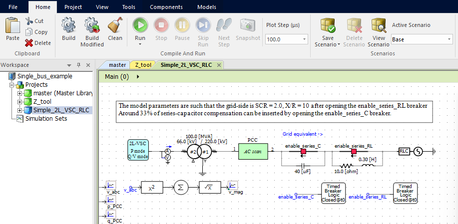
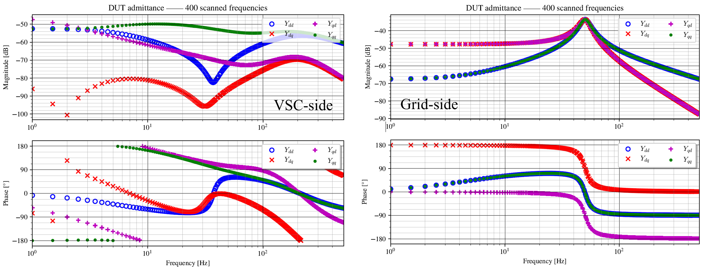
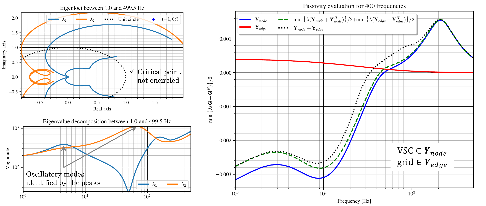

# Usage example
This example demonstrates the most simple usage case consisting of a single-bus analysis. The case study contains a basic averaged model of a two-level voltage source converter with constant DC-voltage and grid-supporting controls connected to a Thevenin equivalent with SCR = 2 and X/R = 10. The grid equivalent impedance can be increased until the SCR is too low and small-signal instability is reached. In addition, a series capacitor can be used to represent the series-compensated trasmission line which also represents a risky situation in terms of small-signal stability.

## Installation
To use the tool, the following pre-requisites are needed
1. Python 3.7 or higher together with
   * Numpy and Scipy (already included in most python packages such as [WinPython](https://winpython.github.io/) or Anaconda)
   * Matplotlib (idem)
   * [PSCAD automation library]([url](https://www.pscad.com/webhelp-v5-al/index.html))

   Check the [end of the page](#basic-installation-of-python-dependencies) for instructions on how to install the previous packages.

2. PSCAD v5 or higher

3. Add the location of the _Z-tool_ folder containing the code to the system path so Python can find the necessary modules: 
Enviroment Variables... -> System variables -> PYTHONPATH -> Directory where _Source_ is located

## Usage
The general tool usage can be summarized in the following steps:
1. Add the Z-tool library to your PSCAD project
2. Place the tool's analysis blocks at the target buses and name them uniquely
3. Define the resulting topology from the POV of the blocks' buses: _in case of single-bus analysis this step is not needed_
4. Speficy the basic simulation options and frequency range for the study
5. Run the frequency scan and small-signal stability analysis functions

If you are using the tool for the first time in a given project, then add the PSCAD library to your workspace and move it before your project files. In case you open an existing project from a different PC, like the [Single_bus_example.pswx](Single_bus_example.pswx), the library will appear grayed-out so simply delete it, add it again with the correct path in your PC and move it up before your project files.

Next, copy the scan blocks from the library and paste them at the desired analysis buses of your system. It is necessary to give them a name so the results can be related to actual system components.
Optionally, the base frequency and steady-state voltage amplitude can be specified.

For a single-bus analysis point, the system topology information does not need to be provided. The next step is to introduce the scan parameters in the corresponding python script. The parameters are provided to the frequency_sweep function which performs the frequency-domain characterization of both the VSC-side and the grid-side simultaneously: [Single_bus_analysis.py](Single_bus_analysis.py) After running the script, the status of the process can be seen in real time.
When the scan is finished, we can access the results in the specificed results folder. The admittances are ploted in _.pdf_ and saved as _.txt_ tab-separated files.

For a detailed system stability analysis, we can simply call the different functions defined in [stability.py](../../Source/tools/stability.py): _nyquist_ for the application of the Generalized Nyquist Criterion (GNC) to determine system stability, _EVD_ to reveal the closed-loop system oscillatory modes and participating buses via eigenvalue decomposition, _passivity_ for the computation of the passivity index of the different system matrices and the application of the small-gain theorem via small_gain. The GNC shows a stable interconnected system, the _EVD_ function indicates two main oscillatory modes and the passivity analysis points out that the VSC cannot be responsible for any instability above 45 Hz.

The last part of the script [Single_bus_analysis.py](Single_bus_analysis.py) performs a simple screening study to determine the maximum series-compensation level before reaching small-signal instability. The previously scanned converter admittance is assumed to be constant, i.e. the VSC operating point change due to the compensation level is neglected. Therefore, the series capacitor impedance matrix is added to the scanned grid impedance for different compensation levels and the _nyquist_ function is called to determine the system stability. The identified instability takes place for compenation levels higher than 35% with oscillatory frequencies below 45 Hz, thus highlighting the passivity-based insights.

## Basic installation of Python dependencies
After installing Python or using an exsiting Python version >3.7, we can add the necessary packages one by one with the use of _pip_ following the steps below.
To install the packages we just need to open a comand window and call pip through python followed by the package we want to instal.
Firstly, we can verify that the python version we call with **py** is the one we intend to use by typing `py --version`
Then, the installation syntax looks like this: `py -m pip install NAMEofTHEpackage`. 
   * _Numpy_, _Scipy_ and _Matplotlib_. Numpy and Scipy packages contain the mathematical functions to handle the numerical data, such as rFFT, inverse matrix computations and EVD. Matplotlib is used to plot the results.
   * _PSCAD automation library_. It is automatically downloaded to your computed after installing PSCAD v5. It should be located in a directory similar to _C:\Users\Public\Documents\Manitoba Hydro International\Python\Packages_. Here there should be a file named _mhi_pscad-2.2.1-py3-none-any.whl_ or similar. Use the same cmd + _pip_ commands as before, but first go to the folder where the package is located using cmd commands.
