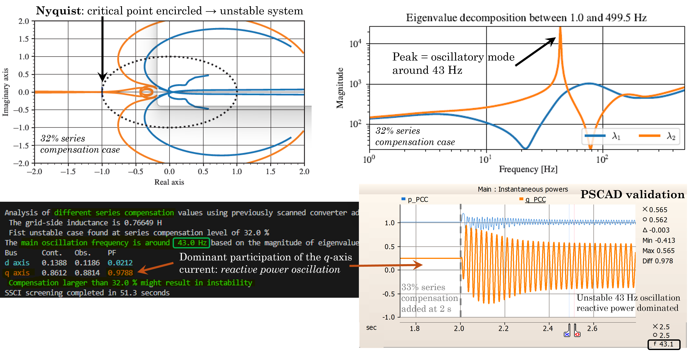

# Simple two level VSC example
This example demonstrates the most simple usage case consisting of a single-bus analysis. The case study contains a basic averaged model of a two-level voltage source converter with constant DC-voltage and grid-supporting controls connected to a Thevenin equivalent with SCR = 2 and X/R = 10. The grid equivalent impedance can be increased until the SCR is too low and small-signal instability is reached. In addition, a series capacitor can be used to represent the series-capacitor compensation which also increases the risk of small-signal stability. This example shows how the Z-tool can be used to quickly obtain insights into the small-signal stability by scanning the converter admittance and performing a Subsynchronous Control Interactions (SSCI) screening study.

The steps below guide you to perform a first frequency-domain analysis using the toolbox. It is assumed that the [pre-requistes](../README.md) are installed.

## Setting up the PSCAD model
Firstly, open the PSCAD workspace file [Single_bus_example.pswx](Single_bus_example.pswx). If you open an existing PSCAD project from a different PC, like the one here, the library will appear grayed-out as it points to a different location. Therefore, in the PSCAD project simply **unload** the grayed-out library by right-cliking on it and selecting _Unload_, then **add the library** file _Z_tool.pslx_ within the Z-tool installation path in your PC (_Scan_ folder at the directory retrieved by cmd `py -m pip show ztoolacdc`), **move it up** before your project files and **save** the changes.

The provided model already contains an AC scan block placed at the Point of Common Coupling (PCC) of the inverter model under analysis as seen below. The name of the scan block is PCC and will be used to retrieve the scan results. The inverter is at side 1 of the block, while the RLC grid equivalent is at side 2. Two breakers can be used to increase the grid-side impedance as well as insert series capacitor compensation at the desired times.

## Basic simulation and scan options
Once the PSCAD model is setup, the scan parameters need to be provided in the corresponding python script [Single_bus_analysis.py](Single_bus_analysis.py). For instance, the frequency sweep is done between `f_min = 1` Hz and `f_max = 500` Hz with a resolution of `f_base = 1` Hz and for a total of `f_points` frequency points.
The simulation time step (in microseconds) is defined by the `t_step` argument and can highly impact the time needed to complete the scan. In addition, the parameters below have a significant influence on the scanning time:
1. **Number of parallel simulations** (`num_parallel_sim` argument): this defines the number of simultaneous PSCAD simulations. The default is 8, which is the limit of the basic academic license. However, for an optimal use of computational resources this parameter should be set to the minimum between the maximum allowed by your PSCAD license and the number of cores of your computer.
2. **Multi-frequency scan** (`multi_freq_scan` argument): when set to `True` it uses 8-tone sinusoidal perturbation signals, while when `False` a single frequency scan is perfomed. Perturbing more frequencies at the same time allows to reduce the total number of simulations proportionally.
3. **FFT time** (`start_fft` argument): this option defines the time in seconds needed for the subsystems to reach sinusoidal steady-state during the injections. It depends on the particular dynamics of each subsystem; it can be approximated as the settling time after applying a small step in the electrical terminal quantities, i.e. voltage magnitude and angle steps. It should be set as small as possible.

These and other parameters are provided to the `frequency_sweep` function which performs the frequency-domain characterization of both the VSC-side and the grid-side simultaneously. Note that for single-bus analysis, such as this one, the system topology file does not need to be provided. For more information on the function arguments, open a python shell, import the function e.g. `from ztoolacdc.frequency_sweep import frequency_sweep`, and type `help(frequency_sweep)`.

## Frequency scan
After running the script [Single_bus_analysis.py](Single_bus_analysis.py), the status of the process can be seen in real time. When the scan is finished, the results can be found in the specificed `results_folder`. The admittances are ploted in _.pdf_ and saved as _.txt_ tab-separated files. You can read these matrices for further analysis by calling the [read_admittance](../../Source/ztoolacdc/read_admittance.py#L58) function.

For a detailed stability analysis, we can simply call the different functions defined in [stability.py](./../../Source/ztoolacdc/stability.py):
- [_nyquist_](./../../Source/ztoolacdc/stability.py#L347) for the application of the Generalized Nyquist Criterion (GNC) to determine system stability
- [_EVD_](./../../Source/ztoolacdc/stability.py#L587) to reveal the closed-loop oscillatory modes and participating buses via eigenvalue decomposition
- [_passivity_](./../../Source/ztoolacdc/stability.py#L267) for the computation of the passivity index of the different system matrices
- [small_gain](./../../Source/ztoolacdc/stability.py#L522) for the application of the small-gain theorem.

The resulting eigenloci below shows a stable interconnected system, and the eigenvalue decomposition indicates two well-damped oscillatory modes. In addition, the passivity analysis points out that this device shows a negative passivitiy index below 48 Hz.

The next part of the script [Single_bus_analysis.py](Single_bus_analysis.py) performs a quick screening study to determine the maximum series-compensation level before reaching small-signal instability. The previously scanned converter admittance is assumed to be constant, i.e. the VSC operating point change due to the compensation level is neglected. Therefore, the series capacitor impedance matrix is added to the scanned grid impedance for different compensation levels and the _nyquist_ function is called to determine the system stability. As seen by the results below, the identified instability takes place for compensation levels higher than 32% resulting in oscillatory frequencies below 45 Hz. Furthermore, the bus participation factors (PF) point at a dominant _q_-axis oscillation (reactive current), which is validated by an EMT simulation adding the series compensation after 2 seconds and showing in a 43 Hz instability mostly visible in the reactive power.

Note that these conclusions might change depending on the operating mode, e.g. PQ-control, P/f Q/V-control, P,Q/V-control, etc. as well as with the operating point, e.g. active power reference. 

Lastly, the script shows how to use the built-in frame conversion functions in [frame_conversion.py](./../../Source/ztoolacdc/frame_conversion.py) to transform the _dq_ frame admittance matrix into the _alpha-beta_ frame and into the _positive-negative_ sequence frame.