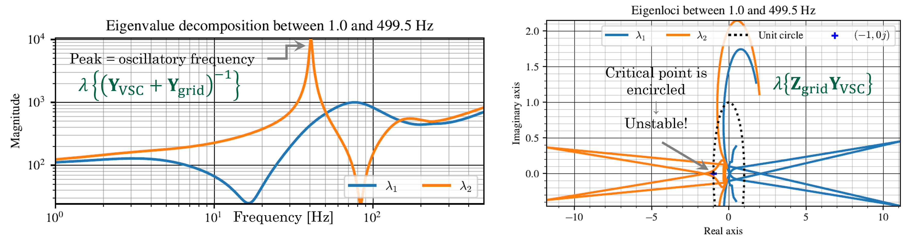

# Simple two level VSC example
This example demonstrates the most simple usage case consisting of a single-bus analysis. The case study contains a basic averaged model of a two-level voltage source converter with constant DC-voltage and grid-supporting controls connected to a Thevenin equivalent with SCR = 2 and X/R = 10. The grid equivalent impedance can be increased until the SCR is too low and small-signal instability is reached. In addition, a series capacitor can be used to represent the series-capacitor compensation which also increases the risk of small-signal stability. 

## Usage
The steps below guide you to perform a first frequency-domain analysis using the toolbox. It is assumed that the [pre-requistes](../README.md) are installed.

1. Add the Z-tool PSCAD library to your PSCAD project

2. Place the tool's analysis blocks at the target buses and name them uniquely

3. Speficy the basic simulation options and frequency range for the study

4. Run the frequency scan and small-signal stability analysis functions

If you are using the tool for the first time in a given project, then add the PSCAD library to your workspace and move it before your project files. The Z-tool library is in the _Scan_ folder within the package, use the cmd `py -m pip show ztoolacdc` to find this folder in your computer. Note that if you open an existing PSCAD project from a different PC, like the [Single_bus_example.pswx](Single_bus_example.pswx), the library will appear grayed-out as it points to a different location. Therefore simply delete it, add it again with the correct Z-tool path in your PC and move it up before your project files.

Next, copy the scan blocks from the library and paste them at the desired analysis buses of your system. It is necessary to give them a name so the results can be related to actual system components.
Optionally, the base frequency and steady-state voltage amplitude can be specified.

For a single-bus analysis point, the system topology information does not need to be provided. The next step is to introduce the scan parameters in the corresponding python script. The parameters are provided to the frequency_sweep function which performs the frequency-domain characterization of both the VSC-side and the grid-side simultaneously: [Single_bus_analysis.py](Single_bus_analysis.py) After running the script, the status of the process can be seen in real time.
When the scan is finished, we can access the results in the specificed results folder. The admittances are ploted in _.pdf_ and saved as _.txt_ tab-separated files.

For a detailed system stability analysis, we can simply call the different functions defined in [stability.py](../../Source/ztoolacdc/stability.py): _nyquist_ for the application of the Generalized Nyquist Criterion (GNC) to determine system stability, _EVD_ to reveal the closed-loop system oscillatory modes and participating buses via eigenvalue decomposition, _passivity_ for the computation of the passivity index of the different system matrices and the application of the small-gain theorem via small_gain. The GNC shows a stable interconnected system, the _EVD_ function indicates two main oscillatory modes and the passivity analysis points out that the VSC cannot be responsible for any instability above 48 Hz.

The last part of the script [Single_bus_analysis.py](Single_bus_analysis.py) performs a quick screening study to determine the maximum series-compensation level before reaching small-signal instability. The previously scanned converter admittance is assumed to be constant, i.e. the VSC operating point change due to the compensation level is neglected. Therefore, the series capacitor impedance matrix is added to the scanned grid impedance for different compensation levels and the _nyquist_ function is called to determine the system stability. The identified instability takes place for compenation levels higher than 35% with oscillatory frequencies below 45 Hz, thus highlighting the passivity-based insights. Note that these results might change depending on the operating mode, e.g. PQ-control, P/f Q/V-control, P,Q/V-control, etc. as well as with the operating point, e.g. active power reference.

