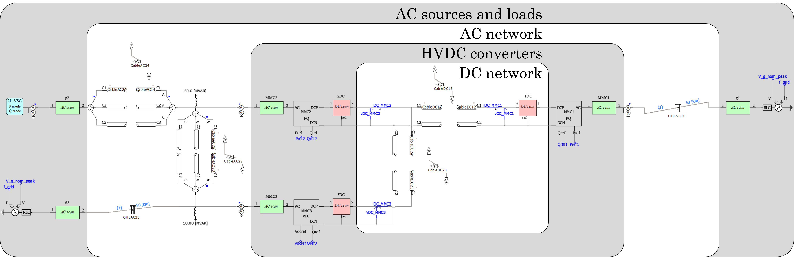
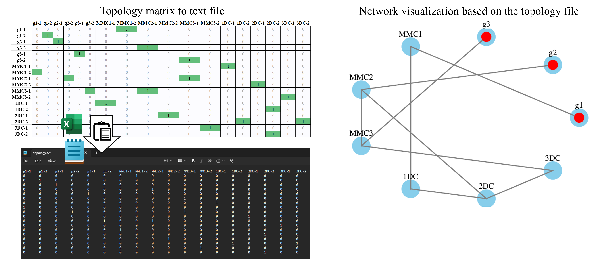
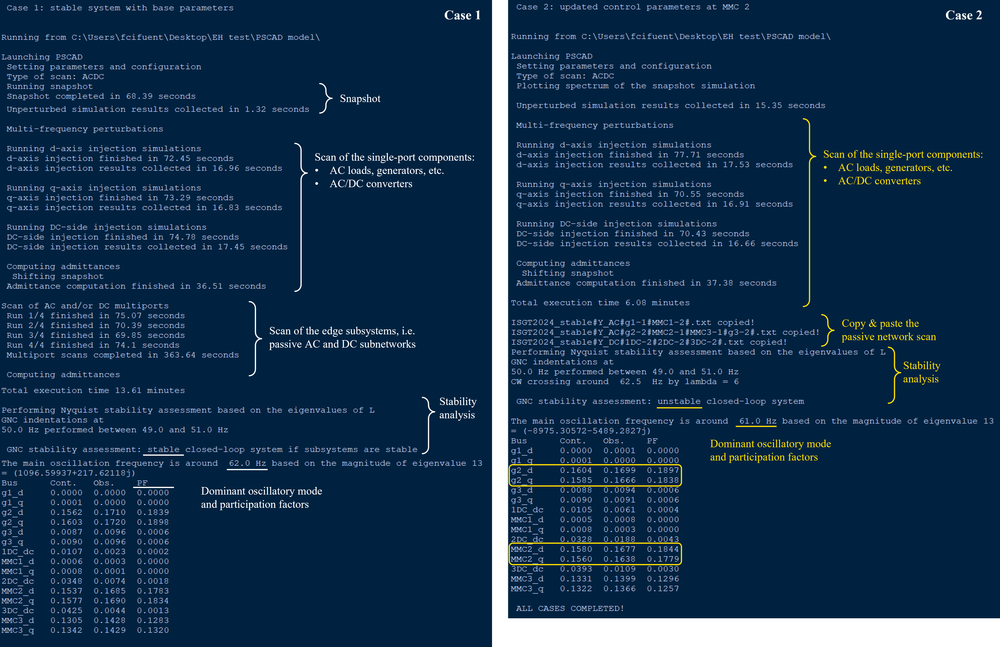
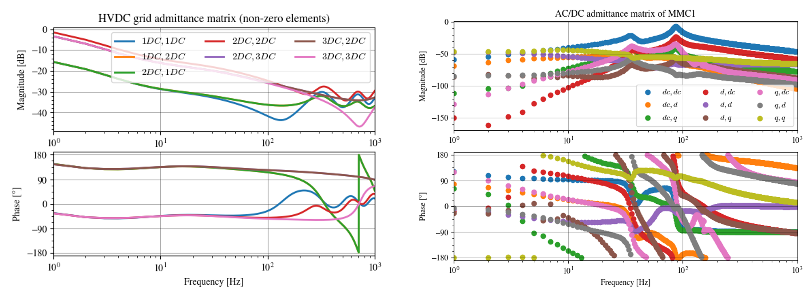
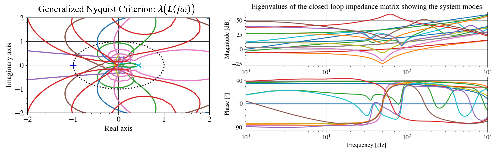
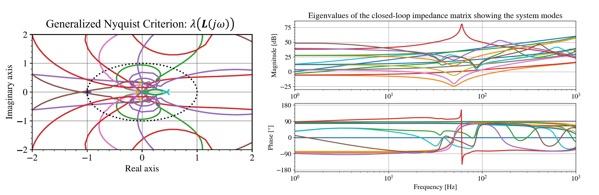

# AC/DC system: electrical energy hub 
This example shows how to carry out the small-signal stability analysis of an hybrid system containing a three terminal HVDC network linking two asynchronous AC areas with parallel transmission via AC and DC corridors. The main difference with respect to previous examples is that the scan and stability analyses are performed by decoupling the system into smaller subsystems at several electrical nodes instead of a single bus. In particular, the selected nodes are those with power converters as their dynamics can negatively interact with other components resulting in small-signal problems. This case is described in detail in [this paper](https://lirias.kuleuven.be/4201452&lang=en) as well as this [webinar](https://www.youtube.com/watch?v=AqK5q3ediU0).

## Setting up the PSCAD model
It is assumed that the [pre-requistes](../README.md) are installed. Similarly to the [2L VSC example](../2L_VSC), when opening the [Test_case.pswx](PSCAD%20model/Test_case.pswx) workspace in the [PSCAD model](PSCAD%20model/) folder, the Z-tool library will appear grayed-out as it points to the computer where it was last saved. Therefore, in the PSCAD project simply **unload** the grayed-out library by right-cliking on it and selecting _Unload_, then **add the library** file _Z_tool.pslx_ within the Z-tool installation path in your PC (_Scan_ folder at the directory retrieved by cmd `py -m pip show ztoolacdc`), **move it up** before your project files and **save** the changes.

The provided model already contains several AC and DC scan blocks placed at the interface points as shown below.

The user can define a unique name for each scan block, which appears on top of each block. This is used to define the topology or interconnection matrix between the blocks so as to carry out the scan and subsequent stability analyses.
The topology is specified via a binary _2N×2N_ symmetric matrix where _N_ is the number of scan blocks involved. This matrix is constructed following the simple logic below:
- **Each entry corresponds a side, i.e. 1 or 2, of each scan block**. The entries are named using the name of the library block in PSCAD followed by a dash and the side number. E.g. _g1-2_ refers to the right-side of the _g1_ scan block located in the right-most part of the system under study and encompassing an AC Thevenin equivalent.
- **The entry _(i, j)_ is 1 when there is a subsystem interconnecting the nodes _i_ and _j_**. E.g. there is an overhead line between the side _1_ of the _g1_ block and side _2_ of the _MMC1_ block, therefore the entry for the _g1-1_ row and the _MMC1-2_ column should contain a one. Since the matrix is symmetric, the entry for the _g1-1_ column and the _MMC1-2_ row is also one. 
- **A diagonal entry  _(i, i)_ is 1 when it includes a complete subsystem**. This means that no other scan blocks are present from that side of the block onwards. For instance, the diagonal entry for _g1-2_ is 1 because in the subsystem at side 2 of the _g1_ block (to the right) does not contain other scan blocks. To the other side, i.e. _g1-1_, there is an overhead line connected to block _MMC1-2_, so the diagonal elements for _g1-1_ and _MMC1-2_ are 0 if a multi-node analysis is to be carried out.
- **All other entries are simply 0**. This matrix is usually sparse, similarly to the incidence matrix of transmission networks, so it is recommended to pre-fill it with zeros.
- **Blocks not included in this matrix are not used**. They are simply ignored during the frequency sweep simulations and analyses and they do not alter the resulting dynamics. This allows to easily focus on different parts of the system for the purpose of dynamic analyses without having to modify the EMT model. 

The extract below illustrates this logic for the right-most part of the system comprising the connections between _g1_ and _MMC1_, as well as between _MMC1_ and the HVDC grid in _1DC, 2DC_ and _3DC_.

|        |  g1-1 |  g1-2 | MMC1-1 | MMC1-2 | 1DC-1 | 1DC-2 | 2DC-1 | 2DC-2 | 3DC-1 | 3DC-2 | ⋯ |
|:------:|:-----:|:-----:|:------:|:------:|:-----:|:-----:|:-----:|:-----:|:-----:|:-----:|:-:|
|  g1-1  |       |       |        |  **1** |       |       |       |       |       |       |   |
|  g1-2  |       | **1** |        |        |       |       |       |       |       |       |   |
| MMC1-1 |       |       |        |        | **1** |       |       |       |       |       |   |
| MMC1-2 | **1** |       |        |        |       |       |       |       |       |       |   |
|  1DC-1 |       |       |  **1** |        |       |       |       |       |       |       |   |
|  1DC-2 |       |       |        |        |       |       |       | **1** |       |       |   |
|  2DC-1 |       |       |        |        |       |       |       |       |       |       |   |
|  2DC-2 |       |       |        |        |       | **1** |       |       |       | **1** |   |
|  3DC-1 |       |       |        |        |       |       |       |       |       |       |   |
|  3DC-2 |       |       |        |        |       |       |       | **1** |       |       |   |
|    ⋮   |       |       |        |        |       |       |       |       |       |       | ⋯ |

The table can just be pasted into a text file; do not include a first column with the block names as this information is already in the header or first row. The path of this file is an argument to the [frequency sweep](../../Source/ztoolacdc/frequency_sweep.py) and [stability analysis](../../Source/ztoolacdc/stability.py) functions. To verify that the system topology is specified as intended, set `visualize_network=True` in the `frequency_sweep` function and check the simplified single-line diagram (SLD) file with ending __network_visualization.pdf_ to make sure the interconnections have been defined as intended. As it can be seen below, the simple SLD captures the interconnections in the EMT model such as the 4-terminal AC network between _g2, MMC2, MMC3_ and _g3_, as well as the 3-terminal HVDC network between _1DC, 2DC_ and _3DC_. The nodes where complete subsystems are present are highlighted in red, e.g. _g1_ where there is a Thevenin equivalent.

## Basic simulation and scan settings
The next step is to introduce the scan parameters in the corresponding python script. The parameters, which are self-descriptive, are provided to the [frequency_sweep](../../Source/ztoolacdc/frequency_sweep.py) function which performs the frequency-domain characterization. You can read about the function's documentation by typing `help(name_of_the_function)` in a python terminal after importing the function, or at the end of the corresponding python file. Most of these parameters have already been used in the previous [2L VSC](../2L_VSC) and [parametric sweep](../Parametric_sweep) examples so they are not repeated here. However, two relevant arguments are particularly handy for multi-infeed systems:
* `scan_multi_ports`: Bool flag to scan the components with single AC/DC ports, i.e. systems identified by 1 in the diagonal entries of the topology file and/or AC/DC converters with only one AC and/or DC port.
* `scan_single_ports`: when set to `True` all other subsystems which have more than one AC and/or DC port, including passive networks or aggregated subsystems, are scanned. It can be set to `False` in case the edge matrix does not need to be scanned.

In this example, the control parameters of MMC2 are modified by setting the _Control_switch_ value to 1 or 0 in the EMT model so as to exemplify both one stable and one unstable scenario. The system is scanned and its stability is evaluated for both cases.
Since the passive grid dynamics do not change when updating control parameters, we can exploit this to reduce runtime by only scanning the passive grid once `scan_multi_ports=True` and then re-using the results in the other cases. Therefore, `scan_multi_ports=True` for the first call of the `frequency_sweep` function, and `scan_multi_ports=False` for other calls. Similarly, the snapshot from the first case can also be re-used for the other cases by setting `snapshot_file="Snapshot"` and `take_snapshot=True` for the first case, and `snapshot_file="Snapshot"` and `take_snapshot=False` for the subsequent cases.

## Results
After running the script, the status of the process can be seen in real time.

When the process is finished, you can access the results in the specificed `results_folder`. The admittances are ploted in _.pdf_ and saved as _.txt_ tab-separated files. You can read and re-plot these matrices by calling the [read_admittance](../../Source/ztoolacdc/read_admittance.py#L58) or Numpy's `load_txt` functions, and then [bode_plot](../../Source/ztoolacdc/plot_utils.py#L176) function.

Since the [stability_analysis](../../Source/ztoolacdc/stability.py#L72) function is called, the results also include detailed system stability properties, such as the application of the Nyquist criterion to determine system stability, the eigenvalue decomposition of the closed-loop impedance matrix to reveal the system oscillatory modes and participating buses for the dominant one, as well as the computation of the passivity index of the different system matrices. The results are displayed during the execution of the script but the corresponding figures can also be found in the `results_folder`. As seen below, the first case shows no encirclements of the critical point while the second case underneath shows an encirclement as well as a dominant oscillation mode around 60 Hz. 

The instability in the second case can be easily verified by a single EMT simulation; the oscillation amplitudes also validate the insights from the participation factor analysis, i.e. the interaction is dominated by the components at _g2_, i.e. the IBR equivalent, and the AC-side of _MMC2_. Note that due to the nature of EMT simulations, slight oscillatory frequency differences can be found depending on the simulation time step.

We recommend reading [these](../README.md#citing-z-tool) openly available papers and checking the webinar [slides](../Doc/Z%20tool%20webinar%20slides%2013-02-2025.pdf) and [recording](https://www.youtube.com/watch?v=AqK5q3ediU0) to better understand the package's functioning principles. Feel free to reach out to [Fransciso Javier Cifuentes Garcia](https://www.kuleuven.be/wieiswie/en/person/00144512) in case of questions.
