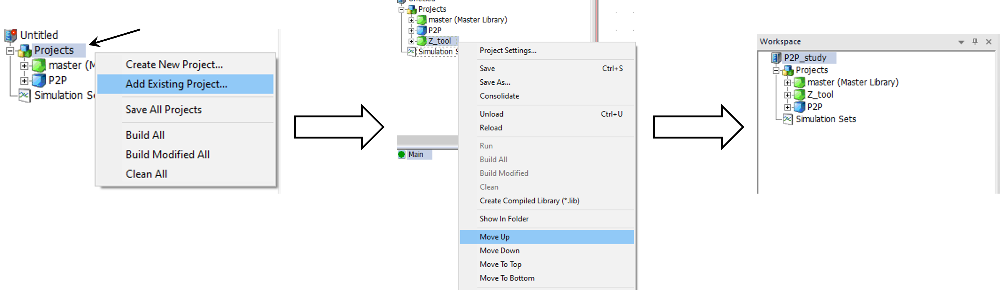
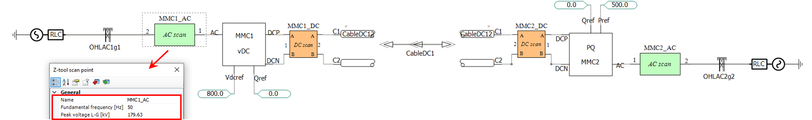
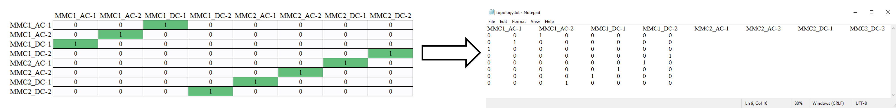
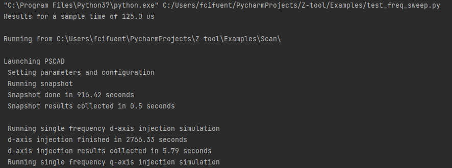
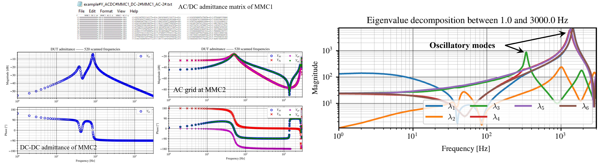

## Examples
A few usage examples are provided here to help you getting familiar with the package functions and frequency-domain analysis methods.
The most simple case consists os a single AC-bus analysis in [2L_VSC](2L_VSC). Additionally, the hybrid AC/DC network examined in [this paper](https://lirias.kuleuven.be/4201452&lang=en) is provided in the [Energy_hub](Energy_hub) folder.

## Installation
To use the tool, the following pre-requisites are needed
1. Python 3.7 or higher together with
   * [Numpy](https://numpy.org/), [Scipy](https://scipy.org/), and [Matplotlib](https://matplotlib.org/)
   * [PSCAD automation library]([url](https://www.pscad.com/webhelp-v5-al/index.html))

   Check the [end of the page](#basic-installation-of-python-dependencies) for instructions on how to install the previous packages.
2. PSCAD v5 or higher is recommeded.
3. Install the Z-tool via cmd `py -m pip install ztoolacdc` 


## General usage
The general tool usage can be summarized in the following steps:
1. Add the Z-tool PSCAD library to your PSCAD project.

If you are using the tool for the first time in a given project, then add the PSCAD library to your workspace and move it before your project files. The _Z_tool.pslx_ is in the _Scan_ folder within the package's installation directory: use the cmd `py -m pip show ztoolacdc` to find this folder in your computer. Note that if you open an existing PSCAD project from a different PC, like those in the [2L_VSC](2L_VSC) and [Energy_hub](Energy_hub) examples, the library will appear grayed-out as it points to a different location. Therefore simply delete it from the workspace, add it again with the correct Z-tool path in your PC and move it up before your project files.



2. Place the tool's analysis blocks at the target buses and name them uniquely.

Copy the scan blocks from the Z-tool PSCAD library and paste them in series at the desired buses. The location of the scan blocks determines the partition points where the subsystems are to be decoupled. It is necessary to give them a **name** so the results can be related to actual system nodes; the given name will apear on top of the scan block after introduced. In addition, the base frequency and steady-state voltage magnitude can be specified, although it is not mandatory.



3. Define the connectivity of the scan blocks: _for single-bus analysis this step is not needed_.

If there is more than one scan block, then the topology information needs to be provided so as to scan the system as efficiently as possible, and later study its stability. Only the blocks specified in the topology file are considered for the scan and subsequent analysis while the others are ignored (by-passed).
Each scan block has two series-connection points, shown in the canvas by the numbers 1 and 2. The topology is specified via a binary _2N×2N_ matrix where _N_ is the number of scan blocks involved, and 1 indicates no further connection to other blocks or interconnection between the different blocks at their corresponding side, which can be 1 or 2. The scan routine decouples the network at these points so each side, i.e. 1 or 2, connects to a different subsystem. When several blocks are interconnected via electrical components they define a _network_. The sides are labed as X-1 and X-2 in the topology file, where X corresponds to the user-defined PSCAD block name. For instance, the HVDC cable network of the point-to-point example is defined from the MMC1_DC block side 1 to the MMC2_DC block side 1. This is specified in the topology file as a 1 in the row MMC2_DC-1 and column MMC1_DC-1 (and vice-versa as this matrix is symmetric). The other side of each DC scan block connects to a MMC which is also connected to an AC scan block at its AC-side. The special case of AC/DC converters is recognized by the package as these are always key components when studying system dynamics.
This table can just be pasted into a text file which path is an argument to the [frequency sweep](../Source/ztoolacdc/frequency_sweep.py) and [stability analysis](../Source/ztoolacdc/stability.py) functions. To verify that the system topology is specified correctly, setting _visualize_network=True_ in the [frequency_sweep](../Source/ztoolacdc/frequency_sweep.py) function returns a simplified single-line diagram pdf file with ending __network_visualization.pdf_ to make sure the interconnections have been correctly defined.
<!---This is done via the modified network undirected graph, i.e. adjacent matrix but diagonals are 1 when there is no other scan block from that node onwards.--->



4. Specify the basic simulation settings and frequency range for the study to the frequency scan and small-signal stability analysis functions

The next step is to introduce the scan parameters in the corresponding python script.
The parameters, which are self-descriptive, are provided to the [frequency_sweep](../Source/ztoolacdc/frequency_sweep.py) function which performs the frequency-domain characterization. You can read about the function's documentation by typing `help(name_of_the_function)` in a python terminal.

```
""" Simple script template for the frequency sweep and frequency-domain analysis of an EMT model"""
from ztoolacdc.frequency_sweep import frequency_sweep
from ztoolacdc.stability import stability_analysis
from os import getcwd

pscad_folder = getcwd()  # Absolute location of the PSCAD workspace (getcwd can be used when the script is in the same folder)
results_folder = pscad_folder + r'\Results'  # Location of the folder to store the results
topology = pscad_folder + r'\topology.txt'  # Absolute path of topology file

workspace_name = "P2P_study"  # Name of the PSCAD workspace (.pswx file)
project_name = "P2P"          # Name of the PSCAD project   (.pscx file)

output_files = 'example'  # Desired name for the output files
perturbations = 8 * 65   # Number of scanned frequencies: ideally a multiple of the possible multi-core simulations number 
f_base = 1  # Base frequency in Hz (determines the frequency resolution)
f_min = 1  # Minimum frequency in Hz
f_max = 3000   # Maximum frequency in Hz

start_fft = 1  # [s] Time for the system to reach steady-state after every perturbation
fft_periods = 1  # Number of periods used in the FFT for the lowest frequency
dt_injections = 2  # [s] Time after the decoupling to reach steady-state (optional, it can be set to zero)

t_snap = 5  # [s] Time for the cold-start of the model after which an snapshot is taken
t_sim = start_fft + fft_periods/f_base  # [s] Simulation time during under sinusoidal perturbations
t_step = 20  # [us] Simulation timestep
v_perturb_mag = 0.002  # Voltage perturbation magnitude in per unit with respect to the steady-state value

frequency_sweep(t_snap=t_snap, t_sim=t_sim, t_step=t_step, v_perturb_mag=v_perturb_mag, start_fft=start_fft,
               f_points=perturbations, f_base=f_base, f_max=f_max, f_min=f_min, show_powerflow=True, fft_periods=fft_periods,
               topology=topology, working_dir=pscad_folder, scan_passives=False, scan_actives=True, dt_injections=dt_injections,
               workspace_name=workspace_name, project_name=project_name, results_folder=results_folder, output_files=output_files)

stability_analysis(topology=topology, results_folder=results_folder, file_root=output_files)
```

After running the script, the status of the process can be seen in real time.



When the process is finished, we can access the results in the specificed results folder. The admittances are ploted in _.pdf_ and saved as _.txt_ tab-separated files. You can read these matrices into by calling the [read_admittance](../Source/ztoolacdc/read_admittance.py) function.
If the [stability_analysis](../Source/ztoolacdc/stability.py) function is called, then the results also include detailed system stability properties, such as the application of the Nyquist criteria to determine system stability, the eigenvalue decomposition of the closed-loop impedance matrix to reveal the system oscillatory modes and participating buses for the dominant one, as well as the computation of the passivity index of the different system matrices.



## Basic installation of Python dependencies
After installing Python or using an exsiting Python version >3.7, you can add the necessary packages with the use of _pip_ following the steps below.
To install the packages we just need to open a comand window and call pip through python followed by the package we want to instal.
Firstly, we can verify that the python version we call with **py** is the intended one by typing `py --version`
Then, the installation syntax looks like this: `py -m pip install NAMEofTHEpackage`. 
   * The _Z-tool_ package can be installed and/or updated via `py -m pip install ztoolacdc` 
   * _Numpy_, _Scipy_ and _Matplotlib_. Numpy and Scipy packages contain the mathematical functions to handle the numerical data, such as rFFT, inverse matrix computations and EVD. Matplotlib is used to plot the results.
   * _PSCAD automation library_. It is automatically downloaded to your computed after installing PSCAD v5. It should be located in a directory similar to _C:\Users\Public\Documents\Manitoba Hydro International\Python\Packages_. Here there should be a file named _mhi_pscad-2.2.1-py3-none-any.whl_ or similar. Use the same cmd + _pip_ commands as before, but first go to the folder where the package is located using cmd commands. More information on the PSCAD automation library can be found [here](https://www.pscad.com/software/pscad/automation-library).

