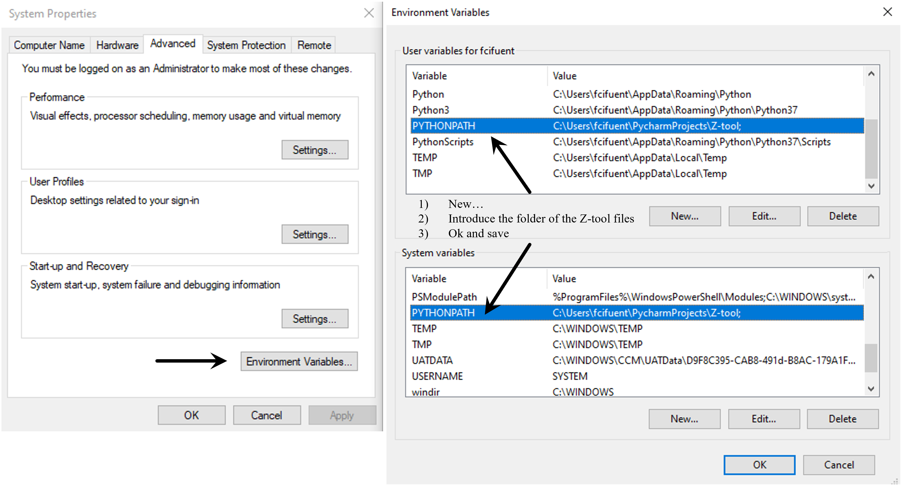
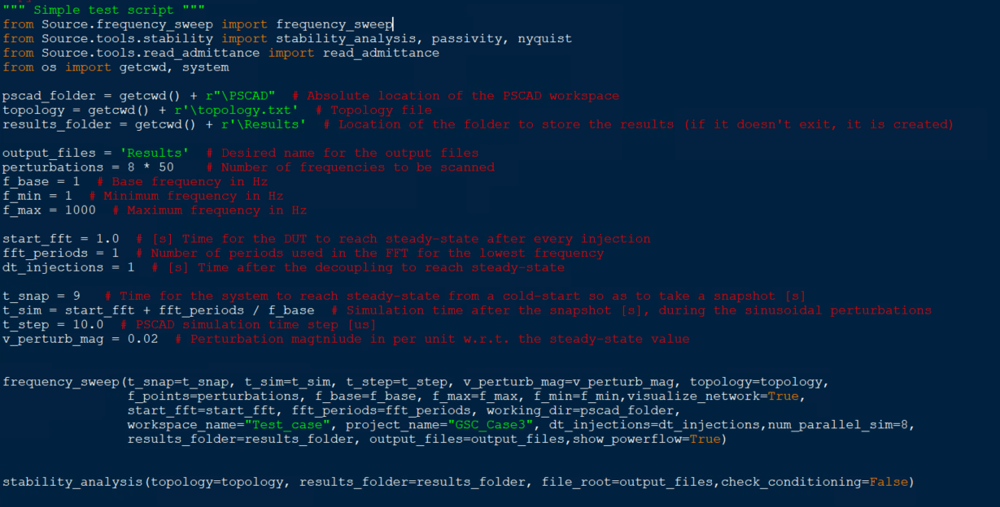

# Usage example
The basic functionality of the Z-tool is demonstrated with a simple point-to-point HVDC link.
## Installation
To use the tool, the following pre-requisites are needed
1. Python 3.7 or higher together with
   * Numpy and Scipy (already included in most python packages such as [WinPython](https://winpython.github.io/) or Anaconda)
   * Matplotlib (idem)
   * [PSCAD automation library]([url](https://www.pscad.com/webhelp-v5-al/index.html))

   Check the [end of the page](#basic-installation-of-python-dependencies) for instructions on how to install the previous packages.

2. PSCAD v5 or higher

3. Add the location of the _Z-tool_ folder containing the code to the system path so Python can find the necessary modules: 
Enviroment Variables... -> System variables -> PYTHONPATH -> Directory where _Source_ is located

## Usage
The tool usage can be summarized in the following steps:
1. Add the Z-tool library to your PSCAD project
2. Place the tool's analysis blocks at the target buses and name them
3. Define the resulting topology from the POV of the blocks' buses
4. Speficy the basic simulation options and frequency range for the study
5. Run the frequency scan and small-signal stability analysis functions

If you are using the tool for the first time in a given project, then add the library to your workspace and move it before your project files.

Next, copy the scan blocks from the library and paste them at the desired analysis buses of your system. It is necessary to give them a name so the results can be related to actual system components.
In addition, the base frequency and steady-state voltage amplitude can be specified, altought it is not needed.

Then, the system topology information needs to be provided so as to scan the system as efficiently as possible, and later study its stability.
This is done via the network undirected graph, i.e. adjacent matrix but diagonals are 1 when there is no other scan block from that node to ground.
In other words, the topology is specified via a matrix with 1s and 0s, where 1s indicate interconnection between the different blocks.
See the example below for the previous point-to-point HVDC link. This table can be pasted into a .txt file as input for.

The next step is to introduce the scan parameters in the python script _test_P2P.py_.
The parameters, which are self-descriptive, are provided to the frequency_sweep function which performs the frequency-domain characterization.

After running the file _test_P2P.py_, the status of the process can be seen in real time.

When the scan is finished, we can access the results in the specificed results folder.
The admittances are ploted in _.pdf_ and saved as _.txt_ tab-separated files.
If the _stability_analysis_ function is called, then the results also include the application of the GNC and EVD to assess the system stability properties.

## Basic installation of Python dependencies
After installing Python or using an exsiting Python version >3.7, we can add the necessary packages one by one with the use of _pip_ following the steps below.
To install the packages we just need to open a comand window and call pip through python followed by the package we want to instal.
Firstly, we can verify that the python version we call with **py** is the one we intend to use by typing `py --version`
Then, the installation syntax looks like this: `py -m pip install NAMEofTHEpackage`. 
   * _Numpy_, _Scipy_ and _Matplotlib_. Numpy and Scipy packages contain the mathematical functions to handle the numerical data, such as rFFT, inverse matrix computations and EVD. Matplotlib is used to plot the results.
   * _PSCAD automation library_. It is automatically downloaded to your computed after installing PSCAD v5. It should be located in a directory similar to _C:\Users\Public\Documents\Manitoba Hydro International\Python\Packages_. Here there should be a file named _mhi_pscad-2.2.1-py3-none-any.whl_ or similar. Use the same cmd + _pip_ commands as before, but first go to the folder where the package is located using cmd commands.
