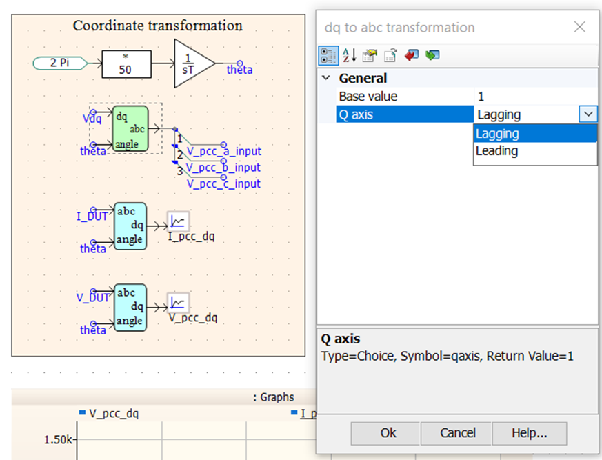
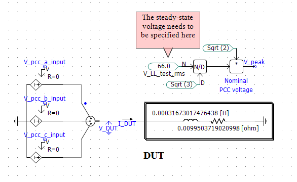
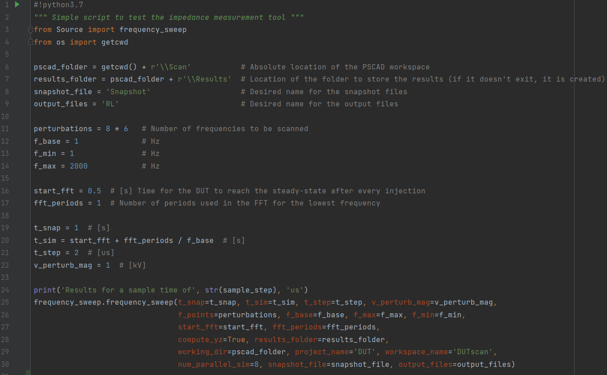
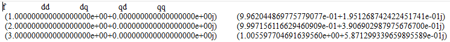
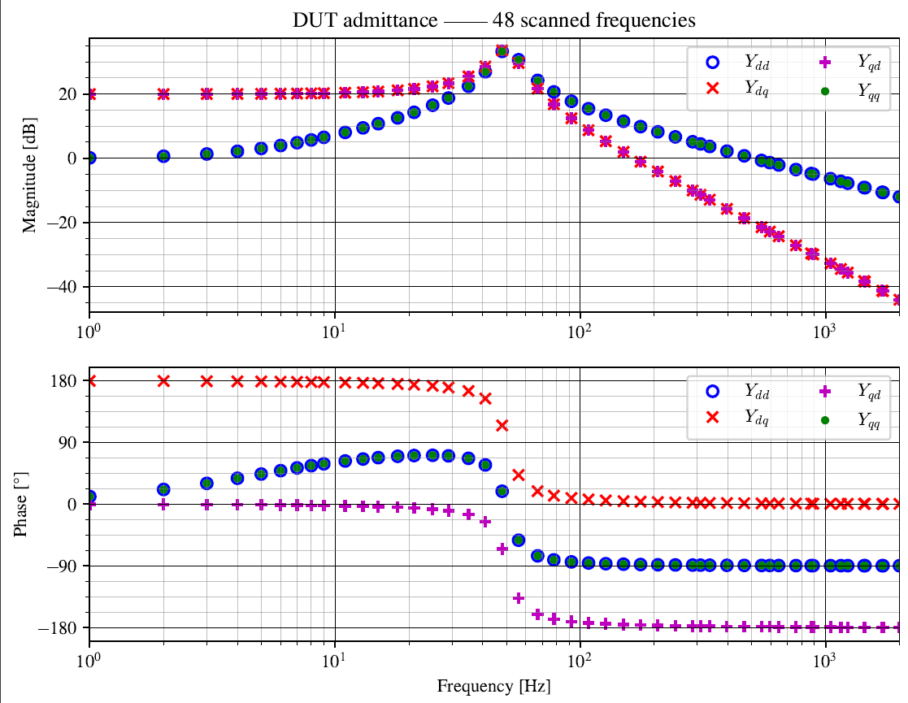

# Usage example
The basic functionality of the Z-tool is demonstrated by scanning a simple DUT.
## Installation
To use the tool, the following pre-requisites are needed
1. Python 3.7 or higher together with
   * Numpy (already included in most python packages such as [WinPython](https://winpython.github.io/) or Anaconda)
   * Matplotlib (idem)
   * [PSCAD automation library]([url](https://www.pscad.com/webhelp-v5-al/index.html))

   Check the end of the page for instructions on how to install the previous packages.

2. PSCAD v5 or higher

3. Add the location of the _Z-tool_ folder containing the code to the system path so Python can find the necessary modules: 
Enviroment Variables... -> System variables -> PYTHONPATH -> Directory where _Source_ is located

## Usage
After opening the PSCAD workspace we can see that there are several sections:

The canvas shows four sections at the top which are modified/used by Python so as to perform the frequency scan of the DUT.
The upper right-most section includes user-defined parameters that can be changed when calling the frequency scan python function.
These parameters can be control settings, setpoints, etc. that we can use to fully characterize a device.

_Care should be taken when it comes to the desired dq-frame convention:_ the q-axis position (lagging or leading) can be 
modified by the Q-axis option of the **coordinate transformation** section (lagging by default). See figure below.

Generally, the user needs to place the DUT in the canvas and connect it to the ideal 3 phase voltage source which is used
to perform the voltage perturbations. In addition, the user needs to specify the steady-state voltage at the connection point.

The next step is to introduce the frequency scan parameters in the python script _test_freq_sweep.py_.
The parameters, which are self-descriptive, are provided to the frequency_sweep function which is the main function of the package.

After running _test_freq_sweep.py_, we will see the status of the process in real time.

When the scan is finished, we can access the results (for example, if `compute_yz = True`) in the previously specificed results folder.
The admittance is ploted and saved in a _.pdf_ file and also a _.txt_ tab separated file structured as **frequency Ydd Ydq Yqd Yqq** is provided.

## Basic installation of Python dependencies
After installing Python or using an exsiting Python version >3.7, we can add the necessary packages one by one with the use of _pip_ following the steps below.
To install the packages we just need to open a comand window and call pip through python followed by the package we want to instal.
Firstly, we can verify that the python version we call with **py** is the one we intend to use by typing `py --version`
Then, the installation syntax looks like this: `py -m pip install NAMEofTHEpackage`. 
   * _Numpy and matplotlib_. Numpy package contains the mathematical functions to handle the numerical data, such as rFFT and inverse matrix computations. Matplotlib is used to plot the admittance.
   * _PSCAD automation library_. It is automatically downloaded to your computed after installing PSCAD v5. It should be located in a directory similar to _C:\Users\Public\Documents\Manitoba Hydro International\Python\Packages_. Here there should be a file named _mhi_pscad-2.2.1-py3-none-any.whl_ or similar. We will use the same cmd + _pip_ commands as before, but first we need to go to the folder where the package is located using cmd commands.
