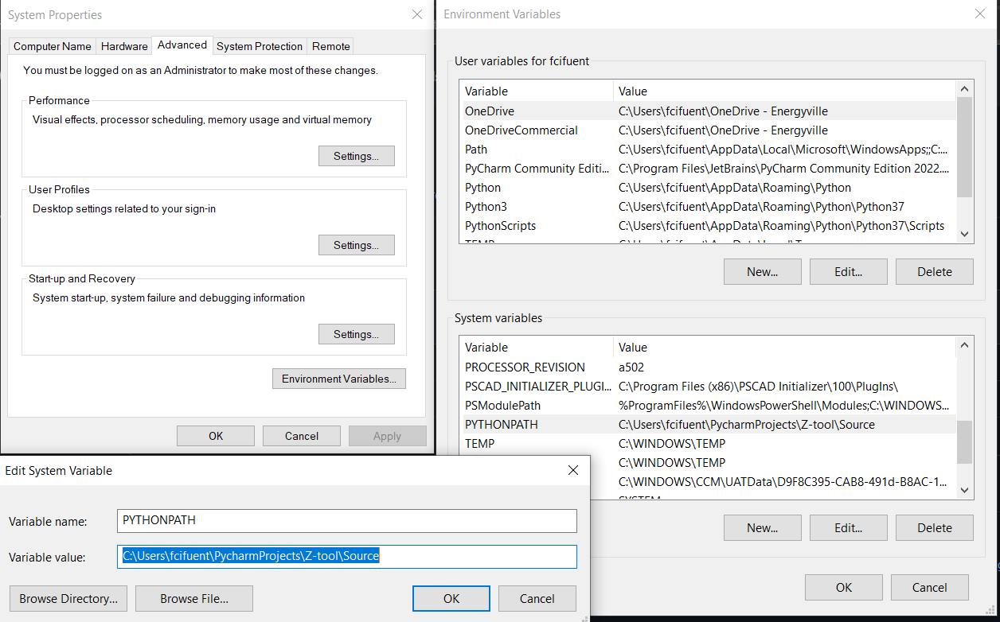
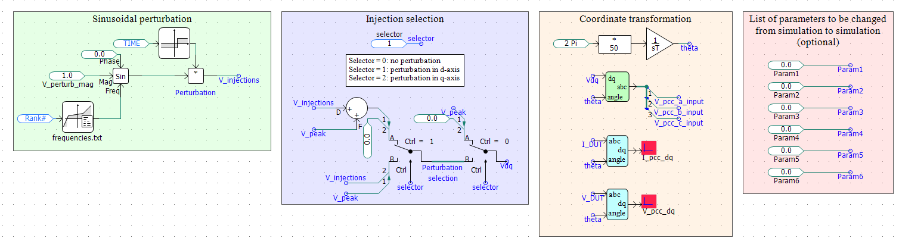

# Usage example
The basic functionality of the Z-tool is demonstrated by scanning a simple DUT.
## Installation
To use the tool, the following pre-requisites are needed
1. Python 3.7 or higher together with
   * Numpy (already included in most python packages such as Anaconda)
   * Matplotlib (idem)
   * [PSCAD automation library]([url](https://www.pscad.com/webhelp-v5-al/index.html))

2. PSCAD v5 or higher

3. Add the location of the _Source_ folder containing the source code to the path so Python can find the necessary modules: 
Enviroment Variables... -> System variables -> PYTHONPATH -> Directory where _Source_ is located

## Usage
Firstly, let's open PSCAD to see what we are doing.

The canvas shows four sections which are modified/used through Python so as to perform the frequency scan of the DUT.
The right-most section includes user-defined parameters that can be changed when calling the frequency scan python function.
These parameters can be control settings, setpoints, etc. that we can use to fully characterize a device.

Generally, the user needs to place the DUT in the canvas and connect it to the ideal 3 phase voltage source which is used
to perform the voltage perturbations. In addition, the user needs to specify the steady-state voltage at the connection point (this value is used for initialization).

The next step is to introduce the frequency scan parameters in the python script _test_freq_sweep.py_.
The parameters, which are self-descriptive, are provided to the frequency_sweep function which is the main function of the package.
After running _test_freq_sweep.py_, we will se the status of the process in real time.
When the scan is finished, we can access the results (for example, if compute_yz = True) in the previously specificed results folder.
The admittance is ploted and saved in a .pdf file and also a .txt tab separated file structured as **frequency Ydd Ydq Yqd Yqq** is provided.

