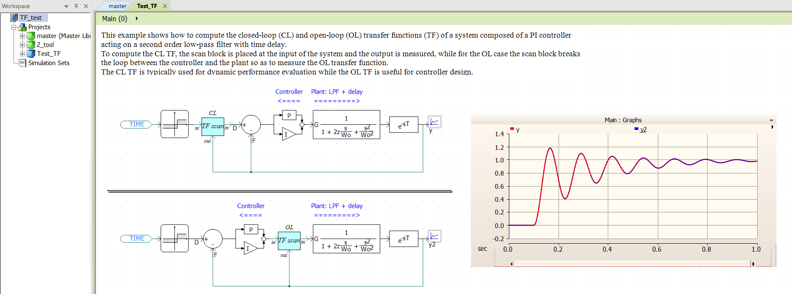
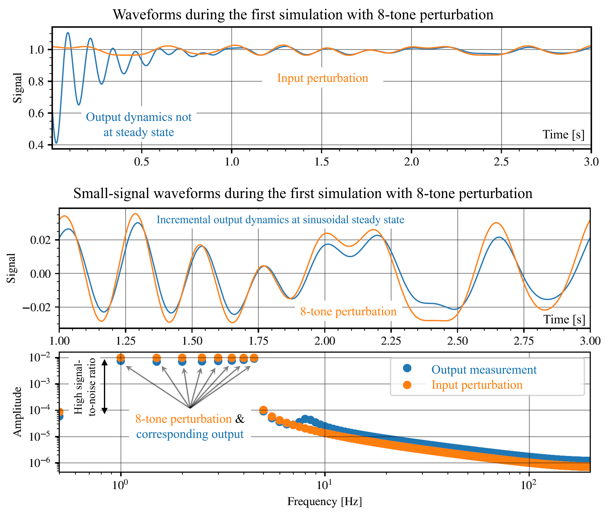
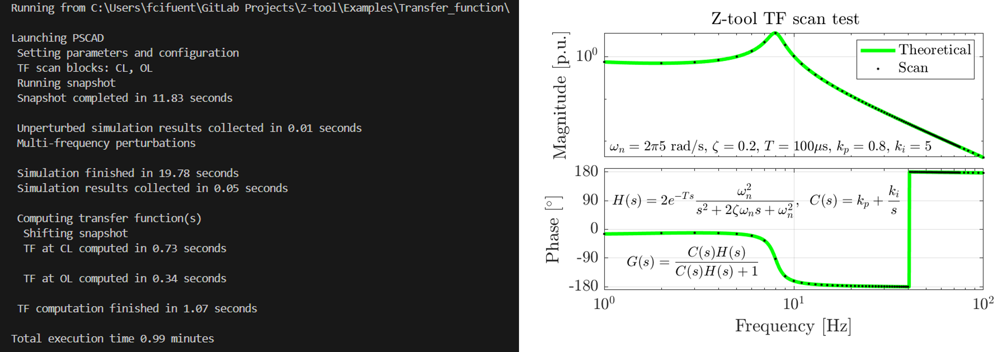

# Transfer function scan example
This example shows how to perform frequency scans to obtain Single-Input Single-Output Transfer Functions (TF). Power systems entail a high degree of complexity and analytically representing their dynamics by transfer functions can be very challenging. Nonetheless, knowing the frequency response of a process provides very valuable information to better understand different phenomena involved as well as to mitigate certain problems and/or design better controllers. Therefore, the function [frequency_sweep_TF](../../Source/ztoolacdc/frequency_sweep.py#L1030) automatically extracts the transfer function between any given quantities in an EMT model.

In order to be as general as possible, the model for this example is very simple so the results can also be verified analytically. Yet, the functionalities also apply to more complex non-linear systems; for example, the modulation TF of the MMC is examined in [this paper](https://doi.org/10.1049/icp.2025.1220).

## Setting up the model
It is assumed that the [pre-requistes](../README.md) are installed. Similarly to the other examples, when opening the [TF_test.pswx](TF_test.pswx) PSCAD workspace in this folder, the Z-tool library will appear grayed-out as it points to the computer where it was last saved. Therefore, in the PSCAD project simply **unload** the grayed-out library by right-cliking on it and selecting _Unload_, then **add the library** file _Z_tool.pslx_ within the Z-tool installation path in your PC (_Scan_ folder at the directory retrieved by cmd `py -m pip show ztoolacdc`), **move it up** before your project files and **save** the changes.

As shown below, the model contains two identical closed-loop systems comprised of a PI controller acting on a plant including a second-order transfer function and a time delay. Two TF scan blocks are used to extract the different dynamics of the system:
* _CL_: inserted in the reference path, i.e at the input of the controller, and the output is measured. This configuration is used to obtain the reference-to-output closed-loop response.
* _OL_: placed between the output of the controller and the plant's input while measuring the output; this setup is used to obtain the control action-to-output open-loop response.

The TF scan block working principle is similar to the AC and DC scan blocks as it continously feeds its left-side _input_ through (no action) until the decoupling time defined in the `frequency_sweep_TF` argument `t_snap` is reached. Then the block supperimposes sinusoidal perturbations on top of the held input so as to generate the _new input_ or excitation signal on its right-side to be fed to the system under study. This signal represents the input of the target transfer function to be scanned. The _output_ pin can be connected to any signal of interest and it represents the output of the transfer function of interest.

## Basic simulation and scan options
Once the model is setup, the scan parameters need to be provided in the corresponding python script [TF_example.py](TF_example.py). The `frequency_sweep_TF` function accepts similar arguments as the `frequency_sweep` function already used in the other examples, such as `num_parallel_sim` and `multi_freq_scan`. However, instead of specifying the electical topology this function accepts the `target_blocks` argument, which is a list of strings corresponding to the target _TF scan_ block names in the model. This argument specifies which TFs are scanned, and those not specified are simply ignored. If `target_blocks` is not provided, then all _TF scan_ blocks are scanned. For example, `target_blocks=["CL"]` would only scan the TF corresponding to the _CL_ TF scan block without affecting the other _OL_ TF scan block.

Since the particular system under study is linear time invariant (LTI), its dynamics do not change depending on its inputs, states or when these are altered. Therefore, the snapshot time can be set arbitrarily and no subsequent waiting time is needed, i.e. `dt_injections=0`. Note that this only applies to **LTI** systems. To illustrate the null impact of the unsteady dynamics prior to the perturbations, the `plot_snapshot` argument is set to `True` so as to generate both time and frequency-domain plots of the snapshot waveforms during the simulation startup. In addition, by setting `plot_perturbation=1` plots corresponding to the first perturbation are produced, as shown below.

For more information on the function arguments, open a python shell, import the function e.g. `from ztoolacdc.frequency_sweep import frequency_sweep_TF`, and type `help(frequency_sweep_TF)`.

## Results
The progress is reported during the execution, and the results can be accessed in the especified `results_folder`. As shown below, the scanned TF (black dots) very well matches the expected TF (green).

Note that the `frequency_sweep_TF` function only works with _TF scan_ blocks, while `frequency_sweep` only works with _AC scan_ and _DC scan_ blocks. In addition, `frequency_sweep_TF` currently only supports SISO scans, while `frequency_sweep` allows for MIMO scans of any size and between any analysis points. Ongoing work includes the improvement of `frequency_sweep_TF` to also retrieve MIMO TFs.