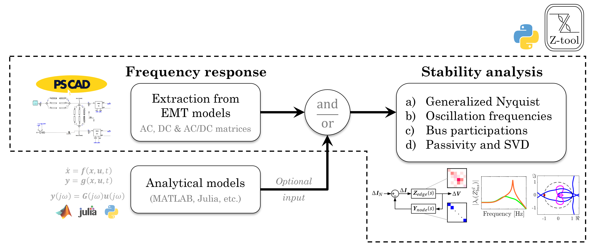

# Z-tool
Z-tool is a Python-based implementation for the frequendy-domain stability analysis of modern power systems.
The core functionalities are measurement/characterization of EMT models in the frequency domain and small-signal stability assessment.
The analysis relies on an existing system model in the EMT simulation software [PSCAD]([url](https://www.pscad.com/)) and/or input frequency response data.

The following features are currently implemented and validated:
- Voltage perturbation-based admittance scan at several nodes, including MMC-based systems and black-box components
- Stability assessment via [Generalized Nyquist Criteria](Source/ztoolacdc/stability.py#L347) applicable to standalone-stable MIMO systems
- Oscillation mode identification via closed-loop eigenvalue decomposition and bus participation factors, [EVD](Source/ztoolacdc/stability.py#L588)
- [Passivity](Source/ztoolacdc/stability.py#L267) assessment and [small gain](Source/ztoolacdc/stability.py#L523) theorem application
- [Frame conversion](Source/ztoolacdc/frame_conversion.py) functions, e.g. from dq-frame to alpha/beta-frame

The flowchart below summarizes a common usage of the tool for stability studies, including frequency-domain system identification ([frequency_sweep](Source/ztoolacdc/frequency_sweep.py#L193)) and several stability analysis functions ([stability](Source/ztoolacdc/stability.py#L72)):




## Installation
To use the toolbox, the following pre-requisites are needed.
1. Python 3.7 or higher together with
   * [Numpy](https://numpy.org/), [Scipy](https://scipy.org/), and [Matplotlib](https://matplotlib.org/) (included in common python installations such as Anaconda)
   * [PSCAD automation library]([url](https://www.pscad.com/webhelp-v5-al/index.html))
2. PSCAD v5 or higher is recommended.
3. Install the Z-tool via cmd `py -m pip install ztoolacdc` or using the repository files.

## Usage
A generic usage of the package can be summarized in the following steps:
1. Add the Z-tool PSCAD library to your PSCAD project
2. Place the tool's scan blocks at the target buses and name them uniquely
3. Define the resulting connectivity of the scan blocks (only for multi-infeed analyses)
4. Specify the basic simulation settings and frequency range for the study
5. Run the frequency scan and small-signal stability analysis functions

Follow the example(s) described [here](Examples) for more guidance. More details on the approach and implemented functions can be found in the papers below and/or this [webinar](https://www.youtube.com/watch?v=AqK5q3ediU0) with the complementary [slides](Doc/Z_tool_webinar_slides_13-02-2025.pdf). The GUI is currently under development.

## Other features
- Transfer function scan via the [frequency_sweep_TF](Source/ztoolacdc/frequency_sweep.py#L1030) function, see the example [here](Examples/Transfer_function)
- Change of PSCAD component values for parametric studies, see the example [here](Examples/Parametric_sweep)
- PSCAD control arguments: clear temporary files, keep PSCAD open, retain certificate, etc.
- Exploit the symmetric properties of the system to reduce the scan time (optional)
- Different computation of participation factors, e.g. admittance-based calculation via [EVD](Source/ztoolacdc/stability.py#L588)
- Allow previous snapshots to be re-used
- Snapshot simulation plots

## Citing Z-tool
If you find the Z-tool useful in your work, we kindly request that you cite the following publications, which you can freely access [here](https://lirias.kuleuven.be/4201452&lang=en) and [here](https://lirias.kuleuven.be/4235609&lang=en).

```bibtex
@INPROCEEDINGS{Cifuentes2024,
  author={Cifuentes Garcia, Francisco Javier and Roose, Thomas and Sakinci, Özgür Can and Lee, Dongyeong and Dewangan, Lokesh and Avdiaj, Eros and Beerten, Jef},
  booktitle={2024 IEEE PES Innovative Smart Grid Technologies Europe (ISGT EUROPE)}, 
  title={Automated Frequency-Domain Small-Signal Stability Analysis of Electrical Energy Hubs}, 
  year={2024},
  pages={1-6},
  doi={10.1109/ISGTEUROPE62998.2024.10863484}}
```
```bibtex
@article{Cifuentes2025,
author = {Francisco Javier {Cifuentes Garcia} and Jef Beerten},
title = {Z-Tool: Frequency-domain characterization of EMT models for small-signal stability analysis},
journal = {Electric Power Systems Research},
volume = {252},
pages = {112405},
year = {2026},
doi = {https://doi.org/10.1016/j.epsr.2025.112405}}
```

## Contact Details
For queries about the package or related work please feel free to reach out to [Fransciso Javier Cifuentes Garcia](https://www.kuleuven.be/wieiswie/en/person/00144512). You can find more open-source tools for power systems analysis in the [etch website](https://etch.be/en/research/open-source-tools).

## License
This is a free software: you can redistribute it and/or modify it under the terms of the GNU General Public License as published by the Free Software Foundation, either version 3 of the License, or (at your option) any later version. Z-tool is distributed in the hope that it will be useful, but without any warranty; without even the implied warranty of merchantability or fitness for a particular purpose. See the GNU General Public License for more details.

## Contributors
* Fransciso Javier Cifuentes Garcia: Main developer
* Thomas Roose: Initial stability analysis functions
* Jan Kircheis, Eros Avdiaj and Özgür Can Sakinci: Validation and support

## Future work
- Scans in split projects
- Switch between current and voltage perturbation
- Computation of stability margins: phase, gain and vector margins
- Sensitivity of the nyquist loci w.r.t. different components' admittance
<!--- - [ ] Minimum simulation time before starting FFT (does it need to be at least as long as the period of the perturbation or could it be smaller?) --->
<!--- - [ ] Transformation to positive and negative sequence representation 
