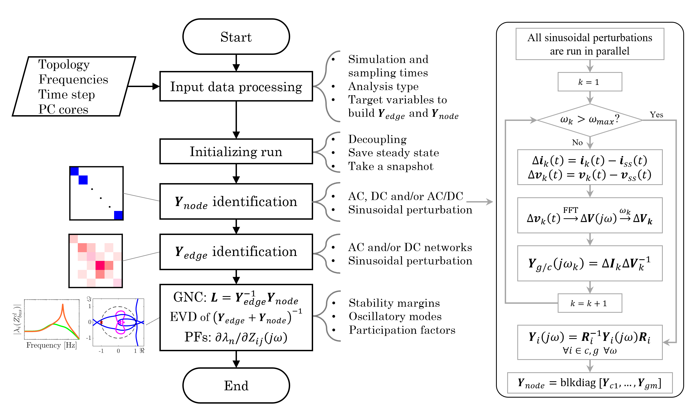

# Z-tool
Z-tool is a Python-based implementation for the stability analysis of modern power systems.
The core functionalities are impedance/admittance characterization and small-signal stability assessment.
The analysis relies on an existing system model in the EMT simulation software [PSCAD]([url](https://www.pscad.com/)).

The following features are currently implemented and validated:
- [x] Voltage perturbation-based admittance scan at several nodes, including MMC-based systems and black-box components
- [x] Stability assessment via Generalized Nyquist Criteria applicable to standalone-stable MIMO systems
- [x] Oscillation mode identification via eigenvalue decomposition (EVD) and bus participation factors
- [x] Passivity assessment and Singular Value Decomposition functions

## Installation
To use the tool, the following pre-requisites are needed.
1. Python 3.7 or higher together with
   * [Numpy](https://numpy.org/), [Scipy](https://scipy.org/), and [Matplotlib](https://matplotlib.org/) (included in common python installations such as Anaconda)
   * [PSCAD automation library]([url](https://www.pscad.com/webhelp-v5-al/index.html))
   
   See the example [here](Examples) for information on how to install the previous in a MS Windows operating system.

2. PSCAD v5 or higher

3. Download or install the Z-tool GitHub repository in a stable location.

4. Add the location of the downloaded files, and specially the _Source_ folder containing the source code,
to the enviroment variables for your user (path) so Python can find the necessary modules: 
Environment Variables... -> System variables -> PYTHONPATH -> Directory where _Source_ is located
If PYTHONPATH does not exit, it needs to be created. This should be done automatically if installing the package.

## Usage
Follow the example described [here](Examples). The GUI is currently under development.

## Contributors
* Fransciso Javier Cifuentes Garcia (KU Leuven / EnergyVille): Main developer
* Thomas Roose (KU Leuven / EnergyVille): Initial stability analysis functions
* Eros Avdiaj and Özgür Can Sakinci (KU Leuven / EnergyVille): Validation and support

## Contact Details
For queries about the package or related work please feel free to reach out to [Fransciso Javier Cifuentes Garcia](https://www.kuleuven.be/wieiswie/en/person/00144512)
## Future work
- [ ] Support for non-topology specification: inefficient but easy to use
- [ ] Minimum simulation time before starting FFT (does it need to be at least as long as the period of the perturbation or could it be smaller?)
- [ ] Exploit the symmetric properties of the admittance matrix for AC (and DC) systems to reduce the scans (less simulation time)
- [x] Allow a previous snapshot to be re-used
- [ ] Switch between current and voltage perturbation, e.g. for the scan of voltage-controlling devices
- [ ] Option to clear the temporary PSCAD files
- [ ] Allow for different computation of the PFs, e.g. admittance PFs
- [ ] Transformation to positive and negative sequence representation
- [ ] Frequency scan and stability analysis optimization based on the passivity properties of the converters
- [ ] Computation of stability margins: phase, gain and vector margins
## 